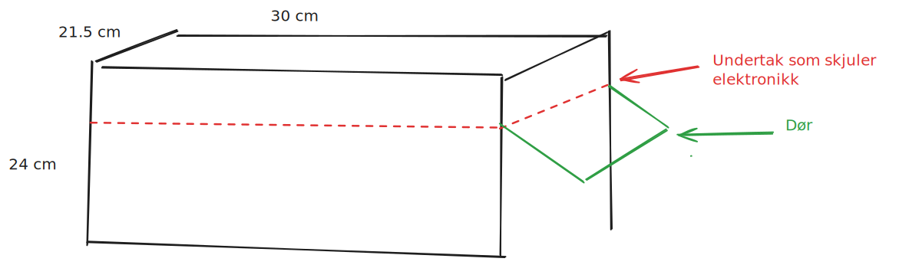

# TOF Smart garasje prosjekt

## Kravspesifikasjoner

Vi skal lage en modell av en smart garasje ved hjelp av arduino og diverse sensorer. Denne garasjen skal ha en dør styres av en servo med et 3d-printet komponent for å feste en papplate med riktig vinkel. Døren svinger opp mot utsiden når døren åpnes, og dette skjer automatisk ved hjelp av en ultralydsensor montert på utsiden av garasjen for å måle distansen til bilen. Hvis døren er låst, vil den ikke åpnes. Døren låses og åpnes med seriell-kommandoer sendt fra pc-en som arduinoen er koblet til.

Videre skal vi implementere et alarmsystem. Dette baserer seg rundt en IR bevegelsessensor koblet opp mot en piezo. Hvis døren er låst, vil alarmen begynne å lage lyd, ellers skal ingenting skje. Den samme sensoren blir koblet opp mot lysdioder slik at om det er låst opp vil de innvendige lysene skrus på av seg selv. Etter en gitt tidsperiode vil disse lysene skru seg av igjen om det ikke detekteres noe bevegelse.

På utsiden av garasjen skal det være en fotoresistor som kobles opp mot utelysene slik at de automatisk går på om natten.

All elektronikken skal skjules med et dobbelt tak, slik at arduinoen, koblingsbrettet osv ligger mellom to tak og er skjult. Det vil være noe som må være synlig på utsiden, men så mye som mulig av ledningene og komponentene vil være skjult under taket.

Vi bruker en eske for utskriftsark, og baserer designet rundt dette. Esken har størrelse $300\,\mathrm{mm} \times 240\,\mathrm{mm} \times 215\,\mathrm{mm}$

